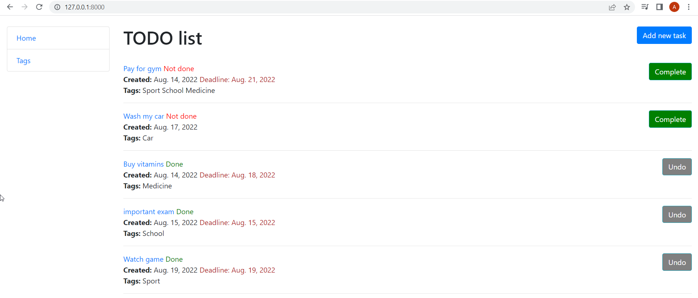
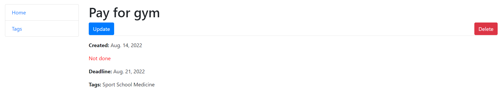
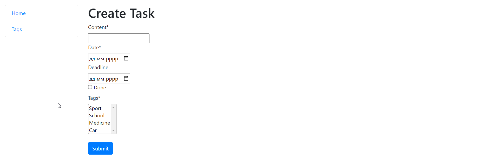
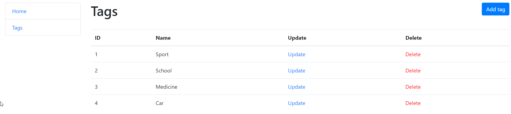

# To-Do List

Django simple to-do list project

## Installation

Python3 must be installed

```shell
git clone https://github.com/LaskoA/to-do-list.git
cd taxi-service-for-deployment

Virtual environment install for Windows:
  - python3 -m venv venv
  - source venv/bin/activate
  - pip install -r requirements.txt
  
Virtual environment install for Mac:
  - sudo pip install virtualenv
  - virtualenv env
  - source env/bin/activate
  
python manage.py runserver
python manage.py makemigrations
python manage.py migrate
```

## Features

- creation of tasks and tags
- ability to modify and delete tasks, set deadlines
- quick change of task`s status (done / not done)


## Demo






